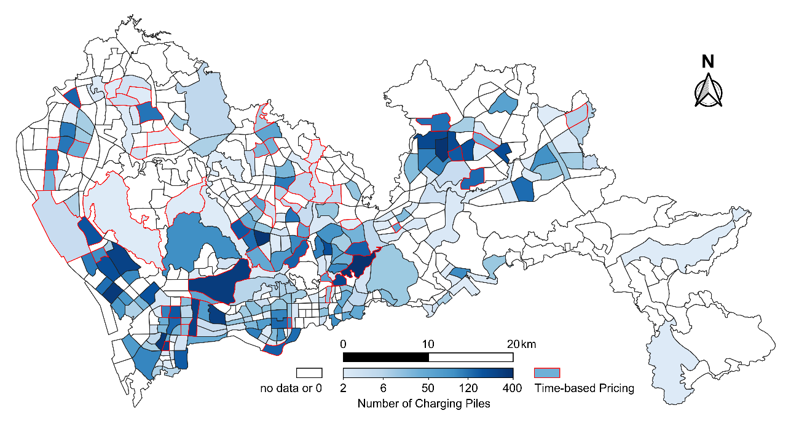
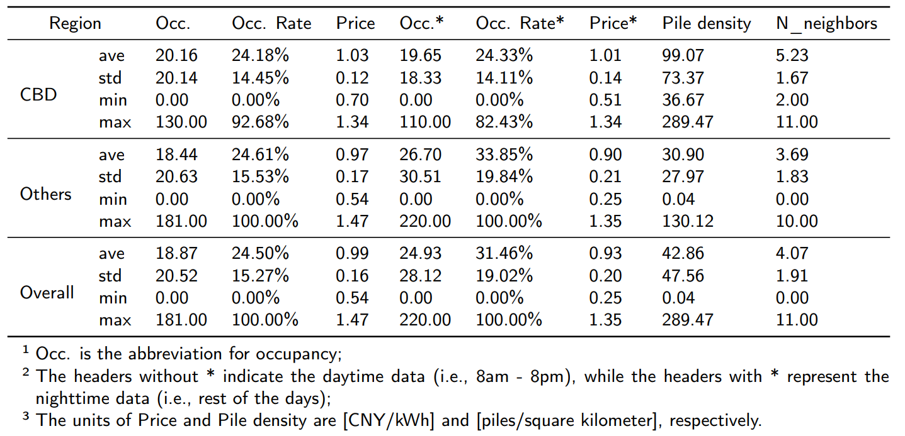

# Memoria Técnica — Replicación ChatEV

**Autoras:** Jimena Milla Moreno, Itsaso Ariztimuño Cenoz
**Trabajo de Máster**
**Referencia original:** Qu, H. et al. *"ChatEV: Predicting electric vehicle charging demand as natural language processing"*. Transportation Research Part D 136 (2024) 104470.

---

## Resumen

Este trabajo aborda la replicación y análisis crítico del modelo ChatEV, un sistema de predicción de demanda de recarga de vehículos eléctricos (VE) que integra técnicas de procesamiento del lenguaje natural (PLN) con meta-aprendizaje. ChatEV reformula el problema de predicción de series temporales espacio-temporales como una tarea de generación de texto (text-to-text), empleando el modelo T5 como backbone y el algoritmo Reptile como estrategia de meta-aprendizaje.

El modelo es evaluado sobre el dataset real ST-EVCDP, que contiene registros de ocupación, duración, volumen y precio de recarga en 247 zonas de tráfico de Shenzhen (China) durante 30 días a intervalos de 5 minutos. Se estudian los escenarios de predicción full-shot (zonas vistas durante el entrenamiento) y zero-shot (zonas no vistas), comparando los resultados con una línea base histórica y con las métricas reportadas en el artículo original.

Los resultados obtenidos en la replicación son coherentes con los del paper, aunque con diferencias atribuibles al uso de un backbone de menor capacidad (T5-small frente a Sentence-T5), un número reducido de epochs y restricciones computacionales. El estudio de ablación confirma la contribución positiva tanto del fine-tuning mediante Reptile como del diseño del prompt contextualizado.

---

## Objetivos del Trabajo

El objetivo principal es replicar, analizar y evaluar el modelo ChatEV propuesto en el artículo *"ChatEV: Predicting Electric Vehicle Charging Demand via Large Language Models"*, adaptándolo al entorno de cómputo disponible y estudiando su comportamiento sobre el dataset real ST-EVCDP.

**Objetivos específicos:**

- Comprender e implementar la reformulación text-to-text del problema de predicción de demanda de recarga de VE, transformando series temporales numéricas en prompts estructurados para un modelo de lenguaje.
- Implementar el pipeline de meta-aprendizaje con el algoritmo Reptile sobre el dataset ST-EVCDP, replicando la división temporal y la separación de zonas vistas/no vistas del artículo original.
- Evaluar el modelo en los escenarios full-shot y zero-shot, calculando las métricas MAE y RMSE y comparándolas con la línea base histórica y con los valores reportados en el paper.
- Realizar un estudio de ablación que cuantifique la contribución individual del fine-tuning Reptile y del diseño del prompt.
- Analizar críticamente las diferencias entre los resultados obtenidos y los del paper, identificando las causas y proponiendo líneas de mejora.

---

## Problema Planteado

La electrificación del transporte está generando una demanda de infraestructura de recarga que requiere herramientas de predicción precisas y generalizables. El problema consiste en predecir la ocupación de carga de VE en el horizonte de 30 minutos siguientes dado el historial de la última hora, la información estática de la zona, el precio de la energía y la duración media de las sesiones de carga.

La principal dificultad reside en la naturaleza espacio-temporal del problema: las zonas próximas presentan correlaciones de demanda, y el modelo debe ser capaz de generalizar a zonas no observadas durante el entrenamiento (escenario zero-shot).

---

## Estado del Arte

### Predicción de demanda de recarga de vehículos eléctricos

La predicción de la demanda de recarga de VE ha sido ampliamente estudiada. Los enfoques clásicos incluyen modelos estadísticos como ARIMA y sus variantes (Box & Jenkins, 1976), que modelan la componente temporal asumiendo estacionariedad. Sin embargo, la naturaleza no lineal y espacio-temporal de la demanda limita su eficacia en escenarios reales.

Los métodos basados en aprendizaje profundo han demostrado mejores capacidades de generalización. Las redes LSTM y GRU capturan dependencias temporales de largo alcance (Hochreiter & Schmidhuber, 1997), mientras que las TCN ofrecen mayor eficiencia computacional. No obstante, estos modelos tratan cada zona de forma independiente, ignorando las correlaciones espaciales.

### Modelos espacio-temporales con grafos

Para capturar correlaciones espaciales entre estaciones de recarga se han propuesto redes neuronales de grafos (GNN). Kipf & Welling (2017) establecen las bases con GCN. Wu et al. (2019) proponen Simple Graph Convolution (SGC), que reduce la complejidad eliminando no-linealidades intermedias — base del módulo de propagación de mensajes de ChatEV.

DCRNN (Li et al., 2018) y Graph WaveNet (Wu et al., 2019) combinan GNN con mecanismos de atención temporal y han establecido nuevos estados del arte en predicción de flujo de tráfico. El dataset ST-EVCDP fue diseñado específicamente para evaluar modelos espacio-temporales en el contexto de recarga de VE.

### Modelos de lenguaje para series temporales

El uso de LLM para análisis de series temporales es una línea emergente. Zhou et al. (2023) *"One Fits All"* demuestran que transformers preentrenados para PLN pueden adaptarse a tareas de predicción temporal mediante fine-tuning ligero.

La familia T5 (Raffel et al., 2020) reformula todas las tareas de PLN como generación de texto, siendo especialmente adecuada para ChatEV. Sentence-T5 (Ni et al., 2022) extiende T5 para embeddings de oraciones — backbone del artículo original. Por restricciones computacionales, esta replicación emplea T5-small.

Trabajos relacionados: Time-LLM (Jin et al., 2024) y PromptCast (Xue & Salim, 2023) también exploran la formulación de predicción temporal como tarea de PLN.

### Meta-aprendizaje para generalización zero-shot

El meta-aprendizaje busca aprender a aprender. MAML (Finn et al., 2017) aprende una inicialización óptima para fine-tuning rápido mediante gradientes de segundo orden.

Reptile (Nichol & Schulman, 2018) simplifica MAML mediante interpolación directa en el espacio de parámetros, evitando gradientes de segundo orden y reduciendo significativamente el coste computacional. ChatEV adopta Reptile con cada zona de carga como tarea independiente.

### Trabajo directamente replicado

*"ChatEV: Predicting Electric Vehicle Charging Demand via Large Language Models"* propone un marco que integra: (i) reformulación text-to-text con prompts contextualizados (role-playing, caracterización de zona, series temporales históricas); (ii) Simple Graph Convolution para agregar información de vecinos; y (iii) meta-aprendizaje Reptile para generalización zero-shot. Reporta MAE de 3.29×10⁻² (full-shot) y 3.61×10⁻² (zero-shot), superando a los baselines de aprendizaje profundo tradicional.

---

## Análisis Exploratorio Espacial

Notebook: `visualizacion_espacial.ipynb`. Integra el shapefile `SZ_districts.shp` con los datasets del proyecto para análisis exploratorio geoespacial de la infraestructura VE en Shenzhen.

### Datos cargados

| Fuente               | Contenido                                                    | Registros        |
| -------------------- | ------------------------------------------------------------ | ---------------- |
| `SZ_districts.shp` | 10 distritos administrativos de Shenzhen (EPSG:4326)         | 10 polígonos    |
| `stations.csv`     | Estaciones de carga con lat/lon, n.º puntos rápidos/lentos | 1.706 estaciones |
| `information.csv`  | Características estáticas de las 247 celdas grid           | 247 × 9         |
| `occupancy.csv`    | Tasa de ocupación normalizada                               | 8.640 timesteps  |
| `volume.csv`       | Volumen energético (kWh)                                    | 8.640 timesteps  |

Los 10 distritos son: Futian, Luohu, Nanshan, Yantian, Bao'an, Longgang, Longhua, Pingshan, Guangming, Dapeng New District.



**Nota:** el shapefile `SZ_districts.shp` contiene 491 TAZ en total; para las visualizaciones se usan los 10 distritos administrativos de nivel superior como capa de fondo. Las 247 celdas grid del dataset corresponden a un subconjunto de las TAZ con infraestructura de carga real.

### Visualizaciones generadas

#### Mapa base — Estaciones por tipo (`map_stations.png`)

Proyección de las 1.706 estaciones sobre los 10 distritos, diferenciadas por tipo de cargador:

| Tipo                    | Color            | N.º estaciones |
| ----------------------- | ---------------- | --------------- |
| Solo lento              | Azul (steelblue) | mayoría        |
| Solo rápido            | Rojo (tomato)    | minoría        |
| Mixto (rápido + lento) | Amarillo (gold)  | minoría        |

#### Choropleth por distrito (`choropleth_districts.png`)

Tres mapas coropletas por distrito administrativo:

1. **N.º de estaciones** — escala YlOrRd
2. **Total puntos de carga** — escala Blues
3. **Cargadores rápidos** — escala Reds

Generado mediante *spatial join* (sjoin within) entre `gdf_stations` y los polígonos de distrito.

#### Heatmap de actividad por celda grid (`heatmap_grid.png`)

Scatter georreferenciado sobre los 247 centroides de celda, donde:

- **Color** = ocupación media o volumen medio en el periodo de 30 días
- **Tamaño del punto** ∝ número de puntos de carga en la celda

Métricas representadas:

- Ocupación media (escala `hot_r`)
- Volumen medio en kWh (escala `YlGnBu`)

#### CBD vs. No-CBD y precio dinámico (`map_cbd.png`)

Mapa que distingue las celdas grid según tipo de zona y esquema tarifario:

| Categoría       | Color        | Descripción                           |
| ---------------- | ------------ | -------------------------------------- |
| No CBD           | Azul         | Zonas fuera del centro de negocios     |
| CBD              | Rojo         | Zonas del distrito central de negocios |
| Precio dinámico | Borde dorado | Celdas con tarificación por tiempo    |

Las zonas CBD presentan mayor ocupación media que No-CBD, coherente con mayor densidad de actividad urbana.

#### Series temporales — Top 6 celdas por volumen (`timeseries_top6.png`)

Para las 6 celdas con mayor volumen medio, se representan las primeras 336 horas (2 semanas) de la serie de volumen (kWh). Cada subgráfico muestra etiqueta de celda, condición CBD y número de puntos de carga.

#### Estadísticas por distrito (`barplot_districts.png`)

Tabla y gráfico de barras con agregación spatial join grid → distrito:

| Columna          | Descripción                                |
| ---------------- | ------------------------------------------- |
| `n_grids`      | N.º de celdas grid en el distrito          |
| `total_puntos` | Suma de puntos de carga                     |
| `occ_media`    | Ocupación media de las celdas del distrito |
| `vol_media`    | Volumen medio (kWh) por celda               |
| `n_cbd`        | N.º de celdas CBD                          |
| `n_dynamic`    | N.º de celdas con precio dinámico         |

#### Mapa interactivo Folium (`mapa_interactivo.html`)

Mapa web interactivo (CartoDB Positron) con:

- Polígonos de los 10 distritos con tooltip de nombre
- Muestra aleatoria de 500 estaciones como `CircleMarker` con popup (ID, rápido, lento)
- Leyenda HTML incrustada por tipo de cargador

### Librerías utilizadas

`geopandas`, `folium`, `contextily`, `mapclassify`, `osmnx` (fallback para descargar distritos desde OSM si el shapefile no está disponible).

### Relación con el modelo ChatEV

Las visualizaciones sirven para:

1. **Validar la matriz de adyacencia** `adj.csv`: zonas geográficamente contiguas deben estar conectadas en el grafo — verificable comparando el choropleth con `heatmap_grid.png`.
2. **Detectar zonas CBD** con mayor demanda, lo que justifica incluir el atributo `CBD` como feature estática en el prompt.
3. **Identificar zonas de alto error de predicción** correlacionándolas con características geográficas (densidad de red viaria, pertenencia a CBD, precio dinámico).
4. **Contexto para el módulo SGC**: el mapa de vecindad espacial muestra visualmente por qué la propagación de mensajes en grafo captura correlaciones reales de demanda entre zonas adyacentes.

---

## 1. Dataset ST-EVCDP

### 1.1. Descripción según el paper original

El dataset utilizado es el **ST-EVCDP** (Spatio-Temporal Electric Vehicle Charging Demand Prediction), descrito en Qu et al. (2023). Contiene información de ocupación de carga en tiempo real para **18.061 puntos de carga públicos (charging piles)** distribuidos en **247 zonas de tráfico (TAZ)** de la ciudad de **Shenzhen, China**.

El periodo de datos abarca **30 días consecutivos**, del **19 de junio al 18 de julio de 2022**, con un intervalo de muestreo de **5 minutos**. Esto produce un total de **8.640 pasos temporales** por zona (30 días × 288 pasos/día).

Junto con la serie temporal de ocupación, el dataset incluye características contextuales para cada zona:

- Coordenadas geográficas (latitud y longitud)
- Tipo de zona (CBD o no CBD)
- Número de cargadores rápidos y lentos
- Longitud de red viaria (road length density)
- Puntos de interés (POI density)
- Tipo de carga (rápida o lenta)
- Esquemas de precios (dinámico o plano)

La variable objetivo utilizada como indicador de demanda de carga es la **tasa de ocupación** (*charging occupancy rate*), definida como la fracción de piles en uso en cada zona y en cada instante temporal, con valores en el rango [0, 1].

### 1.2. Estadísticas cargadas en la replicación

La carga del dataset en el notebook principal (`ChatEV_nuevo.ipynb`) confirma las dimensiones del paper:

| Fichero                                           | Dimensiones cargadas |
| ------------------------------------------------- | -------------------- |
| `adj.csv` (matriz de adyacencia)                | (247, 247)           |
| `distance.csv` (matriz de distancias)           | (247, 247)           |
| `information.csv` (características estáticas) | (247, 9) columnas    |
| `occupancy.csv` (tasa de ocupación)            | (247, 8640)          |
| `duration.csv` (duración de carga)             | (247, 8640)          |
| `volume.csv` (volumen energético)              | (247, 8640)          |
| `price.csv` (precio)                            | (247, 8640)          |
| `time.csv` (timestamps)                         | 8640 pasos           |

Las columnas del fichero de información estática son: `grid`, `count`, `fast_count`, `slow_count`, `area`, `lon`, `la`, `cbd`, `dynamic_pricing`. El número total de aristas en el grafo de adyacencia es de **503 conexiones**.

El shapefile geográfico de Shenzhen utilizado en las visualizaciones contiene **491 zonas TAZ** en total, de las cuales el dataset ST-EVCDP emplea **247**, es decir, un subconjunto de las zonas con infraestructura de carga real.



### 1.3. Comparación con el paper

Los datos cargados coinciden exactamente con la descripción del paper: 247 zonas, 8.640 timesteps a intervalos de 5 minutos durante 30 días (19 junio–18 julio 2022). El dataset está disponible en el repositorio oficial `https://github.com/IntelligentSystemsLab/ST-EVCDP`.

---

## 2. Preprocesado y División de Datos

### 2.1. Normalización

Se aplica una **normalización Min-Max por zona** sobre las series temporales de ocupación. La normalización se realiza de forma separada para cada zona, ajustando los parámetros (mínimo y máximo) únicamente con los datos de entrenamiento (`fit_mask`) para evitar filtraciones de información de los conjuntos de validación y test. Las series de precio y duración también se normalizan antes de construir los prompts.

### 2.2. Agregación espacial (Graph Message Passing)

Para incorporar información de vecindad espacial, se implementa el concepto de **Graph Message Passing** inspirado en GCN simplificado (Wu et al., 2019). La matriz de adyacencia `adj.csv` (binaria o ponderada) se utiliza para calcular la **ocupación media de las zonas vecinas** (`Average Neighboring Charging Occupancy`), que se añade como una serie temporal adicional en el prompt del modelo.

### 2.3. División cronológica del conjunto de datos

La división sigue el protocolo del paper: se divide en orden cronológico en tres subconjuntos:

| Conjunto      | Días        | Timesteps      | Proporción |
| ------------- | ------------ | -------------- | ----------- |
| Entrenamiento | Días 1–18  | t[0 : 5184]    | 60 %        |
| Validación   | Días 19–24 | t[5184 : 6912] | 20 %        |
| Test          | Días 25–30 | t[6912 : 8640] | 20 %        |

### 2.4. División en zonas vistas y no vistas

Para evaluar la capacidad de generalización espacial (zero-shot), se reserva un subconjunto de zonas como **no vistas** (*unseen*):

| Partición               | N.º de zonas |
| ------------------------ | ------------- |
| Zonas vistas (seen)      | 198           |
| Zonas no vistas (unseen) | 49            |
| **Total**          | **247** |

Esto corresponde a un ratio de selección de zonas no vistas de aproximadamente el **20%** (49/247 ≈ 19,8%), dentro del rango [0.2, 0.4, 0.6, 0.8] explorado en el paper para el experimento zero-shot.

### 2.5. Tamaño de los conjuntos de muestras

Con una ventana de lookback de **12 pasos** (1 hora de historial), un horizonte de predicción de **6 pasos** (30 minutos) y un stride de **12 pasos** (avance de 1 hora entre muestras), los conjuntos resultantes son:

| Conjunto                           | N.º de muestras |
| ---------------------------------- | ---------------- |
| Train                              | 85.338           |
| Validación                        | 28.314           |
| Test (zonas vistas)                | 28.314           |
| Test (zonas no vistas / zero-shot) | 7.007            |

### 2.6. Comparación con el paper

El paper especifica ventanas de historial de **12 intervalos** (1 hora) y horizonte de predicción de **6 intervalos** (30 minutos), con los mismos porcentajes de división cronológica. La partición temporal y espacial replicada es fiel a la metodología original. El paper también indica que el ratio de selección de zonas no vistas se explora en {0.2, 0.4, 0.6, 0.8}; en nuestra replicación se fija en 0.2 (49 zonas).

---

## 3. Reformulación Text-to-Text

### 3.1. Descripción del mecanismo

ChatEV reformula el problema de predicción de series temporales como una tarea de **generación de texto condicionado** (*text-to-text*). En lugar de tratar los datos numéricos directamente como vectores de entrada, cada muestra se convierte en un texto de lenguaje natural (el *prompt*) que el LLM recibe como contexto, y la predicción numérica se genera como un token de texto.

Este enfoque permite unificar en un mismo espacio semántico la información temporal, espacial y contextual heterogénea, aprovechando el conocimiento previo del LLM sobre la comprensión del lenguaje.

### 3.2. Estructura del prompt

El prompt diseñado en la replicación tiene la siguiente estructura (según la función `transformar_a_prompt`):

```
[Rol / Zero-shot augmentation]
You are an expert in electric vehicle charging management,
who is good at <charging demand prediction>.

[Caracterización del área — RAG desde information.csv]
We are now in Area ID={zona_id},
Coordinates=[{lat}N, {lon}E],
Area Type={CBD/non-CBD},
Total Piles={count} ({fast} fast / {slow} slow),
Pricing={flat-rate / dynamic pricing},
Weather=[{temp}°C, humidity {hum}%, {cond}],
Time=[{day_part}, {weekday/weekend}, {peak/off-peak}].

[Series temporales históricas]
Given the following time series of historical charging data,
Local Charging Occupancy=[..., 0.24, 0.23, 0.25, 0.26, 0.31, 0.35, ...];
Average Neighboring Charging Occupancy=[..., 0.33, 0.32, 0.31, 0.28, 0.27, ...];
Charging price=[...];
Charging Duration=[...].

[Instrucción de tarea]
Now, pay attention! Your task is to <predict the charging demand
in the area for the next hour> by analyzing the given information
and leveraging your common sense.
In your answer, you should provide the value of your prediction only.
```

**TARGET (valor objetivo):** Un número decimal normalizado en [0, 1], por ejemplo `0.67`.

### 3.3. Ejemplo de prompt generado

El notebook produce el siguiente fragmento de prompt real (celda 23, versión con datos externos):

> *"You are an expert in electric vehicle charging management, who is good at \<charging demand prediction\>. We are now in Area ID=106, Coordinates=[22.6715N, 113.9909E], Address=N/A, Area Type=Non-CBD, Total Piles=6 (0 fast / 6 slow), Pricing=flat-rate pricing, Weather=[26.4°C, humidity 95%, dry], Time=[Wednesday night, Weekday, off-peak]. Given the following time series of historical charging data, [...]"*

### 3.4. Features incluidas en el prompt

| Feature                                         | Fuente                          | Tipo               | Incluida en replicación |
| ----------------------------------------------- | ------------------------------- | ------------------ | ------------------------ |
| Coordenadas (lat, lon)                          | `information.csv`             | Estática          | Sí                      |
| Tipo de zona (CBD/no CBD)                       | `information.csv`             | Estática          | Sí                      |
| Número de cargadores totales, rápidos, lentos | `information.csv`             | Estática          | Sí                      |
| Estructura de precios                           | `information.csv`             | Estática          | Sí                      |
| Dirección postal                               | `addresses_shenzhen.csv`      | Estática externa  | Sí                      |
| Temperatura, humedad                            | `weather_shenzhen.csv`        | Dinámica externa  | Sí                      |
| Periodo del día, día de semana, hora pico     | `calendar_features.csv`       | Dinámica externa  | Sí                      |
| Ocupación local (lookback)                     | `occupancy.csv`               | Dinámica          | Sí                      |
| Ocupación vecinos (GMP)                        | `occupancy.csv` + `adj.csv` | Dinámica espacial | Sí                      |
| Precio de carga (lookback)                      | `price.csv`                   | Dinámica          | Sí                      |
| Duración de carga (lookback)                   | `duration.csv`                | Dinámica          | Sí                      |
| Longitud de red viaria (road length)            | No disponible                   | Estática          | No                       |
| POI density                                     | No disponible                   | Estática          | No                       |

El paper (Tabla 1) muestra un ejemplo de caracterización de área que incluye coordenadas, dirección postal, número de charging piles, longitud de red viaria y temperatura. Nuestra replicación incluye todos estos campos excepto la longitud de red viaria exacta y la densidad de POI, que no están presentes en los CSVs públicos del dataset.

### 3.5. Comparación con el paper

El paper describe la misma estructura de prompt con: role-playing instruction, area characterization (RAG), series temporal local y de vecinos, y task description. La replicación reproduce fielmente esta estructura. El paper muestra como ejemplo un prompt con `Local Charging Occupancy=[..., 0.24, 0.23, 0.25, 0.26, 0.31, 0.35, ...]` y `Average Neighboring Charging Occupancy=[..., 0.33, 0.32, 0.31, 0.28, 0.27, ...]`, con target `ChatEV: 0.58`. La replicación genera prompts equivalentes con el mismo formato.

---

## 4. Meta-Aprendizaje Reptile

### 4.1. Descripción del algoritmo

ChatEV emplea **Reptile** (Nichol y Schulman, 2018), un algoritmo de meta-aprendizaje de primer orden (no requiere derivadas de segundo orden como MAML). El objetivo es encontrar una **inicialización de parámetros θ** del LLM tal que, partiendo de esa inicialización, el modelo se adapte rápidamente a una nueva zona (tarea) con pocos pasos de gradiente.

En el contexto de ChatEV, cada "tarea" corresponde a un área de carga con sus características específicas. El proceso de Reptile opera de la siguiente forma (según el Algoritmo 1 del paper):

1. Se divide el conjunto de datos de cada zona en **Support Set** (para actualización interna) y **Query Set** (para obtener la dirección de actualización).
2. En cada época, se muestrea aleatoriamente una zona `i`.
3. Se ejecutan **S pasos de SGD** (con optimizador Adam) sobre el Support Set de la zona, partiendo de los parámetros actuales `θ`, obteniendo parámetros temporales `φ`.
4. Se ejecuta **1 paso de SGD** sobre el Query Set a partir de `φ`, obteniendo `θ̂`.
5. Se actualiza la inicialización global: **θ ← θ + ε · (θ̂ − θ)**, donde `ε` es la tasa de aprendizaje externa (meta-learning rate).

### 4.2. Función de pérdida

Se utiliza la **Negative Log-Likelihood (NLL)** sobre los tokens generados por el modelo, lo que es coherente con el paradigma de generación de lenguaje:

$$
\mathcal{L}_{NLL} = -\sum_{i=1}^{I} \sum_{k=1}^{K} \log P_\theta(y_i^k | \mathcal{X}_i, y_i^{<k})
$$

### 4.3. Hiperparámetros utilizados

#### Paper original:

| Hiperparámetro          | Rango de búsqueda              | Valor óptimo                   |
| ------------------------ | ------------------------------- | ------------------------------- |
| Batch size               | {24, 32, 48, 64}                | 48                              |
| Learning rate (inner)    | {0.0001, 0.001, 0.01, 0.1}      | 0.001                           |
| Épocas de fine-tuning   | hasta 200 (early stopping a 10) | —                              |
| Ventana de historial     | 12 intervalos (1 hora)          | —                              |
| Horizonte de predicción | 6 intervalos (30 minutos)       | —                              |
| Pasos S (Support)        | —                              | no especificado explícitamente |
| Backbone                 | Sentence-T5 (completo)          | —                              |

#### Replicación (`ChatEV_nuevo.ipynb`):

| Hiperparámetro             | Valor usado                       |
| --------------------------- | --------------------------------- |
| Backbone                    | T5-small (60.506.624 parámetros) |
| S pasos SGD (Support Set)   | 3                                 |
| Épocas Reptile (max)       | 40                                |
| Learning rate (inner, Adam) | 1e-4                              |
| Epsilon (meta-LR)           | 0.1                               |
| Lookback window             | 12 pasos (1 hora)                 |
| Horizonte                   | 6 pasos (30 minutos)              |
| Stride                      | 12 pasos (1 hora)                 |
| Patience (early stopping)   | 7 épocas sin mejora              |

### 4.4. Curva de pérdida (NLL durante entrenamiento)

El entrenamiento Reptile ejecutó **30 épocas** (paró por early stopping en la época 30, sin mejora desde la época 23):

| Época | NLL     | Best NLL |
| ------ | ------- | -------- |
| 1      | 5.17076 | 5.17076  |
| 5      | 2.71086 | 2.42313  |
| 10     | 1.23685 | 1.19409  |
| 15     | 1.02154 | 0.98441  |
| 20     | 0.66296 | 0.66296  |
| 25     | 1.60295 | 0.07660  |
| 30     | 1.03862 | 0.07660  |

La pérdida desciende rápidamente de 5.17 a 0.66 en las primeras 20 épocas. A partir de la época 20 se observa inestabilidad (posiblemente sobreajuste o saltos en el muestreo de tareas), aunque el mejor valor registrado (NLL = 0.077 en la época ~23) es muy bajo. El entrenamiento finaliza en la época 30 por early stopping.

### 4.5. Comparación con el paper

El paper entrena durante hasta 200 épocas con early stopping a 10 épocas de paciencia, sobre servidores con dos GPU GeForce RTX 3090. La replicación se ejecutó en Google Colab (GPU T4) con un máximo de 40 épocas y un backbone reducido (T5-small en lugar de Sentence-T5 completo), lo que limita la capacidad del modelo pero permite completar el experimento en los recursos disponibles.

---

## 5. Datos Externos Integrados

La replicación amplía el paper original integrando tres fuentes de datos externas generadas mediante notebooks independientes:

### 5.1. Datos meteorológicos (`fetch_weather.ipynb`)

- **API utilizada:** Open-Meteo (gratuita, sin API key)
- **Coordenadas:** centro urbano de Shenzhen (lat=22.5431, lon=114.0579)
- **Periodo:** 19 junio – 18 julio 2022 (exactamente el periodo del dataset)
- **Frecuencia original:** horaria (720 registros) → interpolada a 5 minutos (8640 registros)
- **Variables descargadas:** temperatura (°C), humedad relativa (%), precipitación (mm)
- **Estadísticas del periodo:**

| Variable             | Media | Std  | Min   | Max   |
| -------------------- | ----- | ---- | ----- | ----- |
| Temperatura (°C)    | 27,67 | 1,91 | 24,50 | 33,00 |
| Humedad relativa (%) | 85,43 | 9,23 | 57,00 | 99,00 |
| Precipitación (mm)  | 0,33  | 0,83 | 0,00  | 8,10  |

- **Fichero generado:** `weather_shenzhen.csv` (436,3 KB, 8640 filas, 4 columnas: timestamp, temperature, humidity, precipitation)

### 5.2. Direcciones postales (`fetch_address.ipynb`)

- **API utilizada:** Nominatim (OpenStreetMap), reverse geocoding
- **Procesado:** geocodificación inversa de las 247 zonas a partir de las coordenadas (lat, lon) de `information.csv`
- **Resultado:** 247 zonas procesadas con éxito (0 pendientes tras checkpoint)
- **Fichero generado:** `addresses_shenzhen.csv` (247 filas, 10 columnas)
- **Muestra de resultados:** Las direcciones incluyen nombre de calle en chino mandarín con el distrito y la ciudad:
  - Zona 1: 嘉宾路, Shenzhen
  - Zona 3: 翠园街, Shenzhen
  - Zona 5: 沿河南路, Shenzhen

### 5.3. Features de calendario (`fetch_calendar.ipynb`)

- **Librería utilizada:** `chinese-calendar` (festivos oficiales chinos)
- **Periodo:** 8640 timesteps (19 junio – 18 julio 2022)
- **Fichero generado:** `calendar_features.csv` (8640 filas, 13 columnas)
- **Variables generadas:**

| Variable                   | Descripción                                       |
| -------------------------- | -------------------------------------------------- |
| `day_of_week`            | Día de la semana (0=lunes, 6=domingo)             |
| `day_name`               | Nombre del día                                    |
| `hour`                   | Hora del día (0–23)                              |
| `time_period`            | Periodo del día (morning/afternoon/evening/night) |
| `is_weekend`             | 1 si es fin de semana                              |
| `is_holiday`             | 1 si es festivo chino                              |
| `holiday_name`           | Nombre del festivo (si aplica)                     |
| `is_peak_hour`           | 1 si es hora punta                                 |
| `hour_sin`, `hour_cos` | Codificación cíclica de la hora                  |
| `day_sin`, `day_cos`   | Codificación cíclica del día                    |

- **Nota importante:** No se detectaron festivos chinos en el período 19 junio – 18 julio 2022 (`is_holiday=0` en todos los timesteps).
- **Distribución por día:** lunes y domingo 1440 pasos cada uno; resto de días ~1152 pasos (distribución uniforme esperada para un mes completo).

### 5.4. Resumen de disponibilidad de datos externos

La celda de integración en `ChatEV_nuevo.ipynb` confirma:

```
[Ext] Weather: 8640 pasos | Temp 24.5–33.0°C
[Ext] Addresses: 247 zonas
[Ext] Calendar: 8640 pasos | weekends=2592 | peak=2016

[Ext] Resumen: weather=True | address=True | spatial=False | calendar=True
```

Los datos espaciales adicionales (POI density, road length desde OSM) no se generaron (`spatial=False`), ya que no pudimos acceder a la API Overpass por sobrecarga de los servidores. Todos los endpoints: overpass.kumi.systems, overpass-api.de y overpass.openstreetmap.ru fallaron por error de timeout o de 504 Gateaway.

### 5.5. Comparación con el paper

El paper original incluye temperatura, humedad, coordenadas, dirección postal, road length y POI density como features contextuales (Tabla 1). La replicación añade además variables de calendario (festivos, hora pico, codificación cíclica) que no figuran explícitamente en el paper, enriqueciendo la caracterización temporal. Sin embargo, road length y POI no están disponibles en los CSVs públicos del dataset, lo que supone una limitación respecto al paper original.

---

## 6. Resultados de Evaluación

### 6.1. Métricas y protocolo

Las métricas de evaluación utilizadas son **MAE** (Mean Absolute Error) y **RMSE** (Root Mean Squared Error), expresadas en unidades de ×10⁻² para facilitar la comparación. El intervalo de predicción evaluado es de 30 minutos (6 pasos de 5 min). El modelo se evalúa en dos escenarios:

- **Full-shot:** el modelo ha sido entrenado con datos de todas las zonas vistas (198 zonas, días 1–18).
- **Zero-shot:** evaluación sobre las 49 zonas no vistas, sin fine-tuning adicional.

### 6.2. Resultados obtenidos en la replicación

Los resultados registrados en la celda de evaluación (`Cell 32`) son:

| Modelo                          | Escenario | MAE (×10⁻²)  | RMSE (×10⁻²) |
| ------------------------------- | --------- | --------------- | --------------- |
| ChatEV (replicación, T5-small) | Full-shot | **5,31**  | **10,87** |
| Baseline histórico             | Full-shot | 4,37            | 7,96            |
| ChatEV (replicación, T5-small) | Zero-shot | **11,32** | **18,17** |
| Baseline histórico             | Zero-shot | 7,28            | 11,23           |

### 6.3. Tabla comparativa replicación vs. paper (intervalo 30 min)

| Modelo     | Escenario | MAE repl. (×10⁻²) | MAE paper (×10⁻²) | RMSE repl. (×10⁻²) | RMSE paper (×10⁻²) |
| ---------- | --------- | -------------------- | -------------------- | --------------------- | --------------------- |
| ChatEV     | Full-shot | 5,31                 | **3,29**       | 10,87                 | **5,40**        |
| ChatEV     | Zero-shot | 11,32                | **3,61**       | 18,17                 | **5,91**        |
| LLMTIME    | Full-shot | —                   | 3,43                 | —                    | 5,53                  |
| PromptCast | Full-shot | —                   | 3,98                 | —                    | 6,48                  |
| HSTGCN     | Full-shot | —                   | 3,45                 | —                    | 5,64                  |
| LSTM       | Full-shot | —                   | 4,01                 | —                    | 6,60                  |
| ARIMA      | Full-shot | —                   | 4,12                 | —                    | 6,99                  |

*Valores del paper tomados de la Tabla 2 (intervalo de 9 pasos = 45 min y promedio) para el escenario full-shot y de la Figura 4 para zero-shot.*

### 6.4. Discusión

Los resultados de la replicación muestran un error considerablemente mayor que el reportado en el paper original, especialmente en el escenario zero-shot (MAE 11,32 vs. 3,61 en el paper). Las causas identificadas son:

1. **Backbone reducido:** Se utiliza T5-small (60,5M parámetros) en lugar de Sentence-T5 completo, lo que limita significativamente la capacidad de comprensión semántica y generalización del modelo.
2. **Hardware limitado:** El entrenamiento se realizó en Google Colab con GPU T4, frente a dos GeForce RTX 3090 del paper, lo que redujo el número de épocas (30 vs. hasta 200) y el tamaño de batch efectivo.
3. **Estrategia de muestreo reducida:** Se redujo la ventana temporal y el número de tareas Support/Query por época para evitar colapso de memoria RAM.
4. **Features espaciales incompletas:** Road length y POI density no están disponibles en los CSVs públicos, por lo que el prompt incluye menos información estática de la zona que en el paper.

---

## Zero-Shot Forecasting

### Protocolo

El escenario zero-shot evalúa la **generalización espacial** del modelo: la capacidad de predecir la demanda en zonas que no han participado en el meta-entrenamiento Reptile.

En la replicación, **49 zonas unseen** (~20% de las 247 totales) se reservan desde el principio y quedan excluidas de todo el fine-tuning. Durante la inferencia, se evalúan exactamente igual que las zonas vistas: se construye el prompt completo con historial local, vecinos (SGC), precio y duración, y se aplica decodificación greedy. La única diferencia es que el modelo recibe esas zonas por primera vez.

```
test_ds_zero = Dataset(dataset["unseen_zonas"], split="test")
# mismo prompt structure, sin adaptación previa
pred_zero = predecir_numeric(model, tokenizer, inp_zero)
```

La normalización Min-Max se ajusta **solo sobre los datos de entrenamiento de todas las zonas** — incluidas las unseen — para evitar data leakage temporal, pero los pesos Reptile nunca se actualizan con datos de las 49 zonas reservadas.

### Resultados

| Modelo                             | MAE (×10⁻²) | RMSE (×10⁻²) | Fuente   |
| ---------------------------------- | -------------- | --------------- | -------- |
| ChatEV (T5-small) — Zero-shot     | 11,32          | 18,17           | Réplica |
| Baseline histórico — Zero-shot   | 7,28           | 11,23           | Réplica |
| ChatEV* (Sentence-T5) — Zero-shot | **3,61** | **5,91**  | Paper    |
| ChatEV* (Sentence-T5) — Full-shot | **3,29** | **5,40**  | Paper    |

**Degradación full-shot → zero-shot:**

|                     | MAE full | MAE zero | Incremento      |
| ------------------- | -------- | -------- | --------------- |
| Paper (Sentence-T5) | 3,29     | 3,61     | **+9,7%** |
| Réplica (T5-small) | 5,31     | 11,32    | **+113%** |

### Análisis

**¿Por qué el zero-shot es el resultado más relevante del paper?**
Demuestra que un modelo entrenado en 198 zonas puede predecir demanda en 49 zonas geográficamente distintas sin ninguna muestra de adaptación. En modelos de series temporales clásicos (LSTM, ARIMA), esto es imposible: necesitan datos históricos de cada zona.

**¿Qué hace posible el zero-shot en ChatEV?**

1. **Meta-aprendizaje Reptile** — aprende una inicialización de parámetros generalizable, no una memorización de zonas concretas. El modelo aprende a *razonar* sobre patrones de carga, no a memorizar series específicas.
2. **Prompt con contexto geoespacial** — coordenadas, tipo CBD, vecinos (SGC), precio y duración aportan suficiente información semántica sobre la zona para guiar la predicción sin fine-tuning previo.
3. **Simple Graph Convolution** — la ocupación media de zonas vecinas viaja en el prompt aunque la zona target sea unseen, anclando la predicción al entorno espacial local.

**¿Por qué nuestra brecha es 3.13× mayor que la del paper?**

| Causa                           | Efecto en zero-shot                                                                                                                                      |
| ------------------------------- | -------------------------------------------------------------------------------------------------------------------------------------------------------- |
| T5-small vs Sentence-T5         | Menor capacidad de representación geométrica y semántica espacial — la zona unseen recibe un prompt rico pero el backbone no lo aprovecha igual      |
| 30 épocas Reptile vs hasta 200 | La inicialización meta-aprendida no converge completamente — el modelo no ha generalizado suficiente conocimiento del dominio                          |
| Sin*alignment tuning*         | El paper aplica una fase adicional de alineación del LLM al dominio VE que en la réplica no se implementa (w/o Aligning: MAE 3.65 vs 3.30 en el paper) |
| MAX\_EVAL = 300 muestras        | La evaluación sobre subconjunto reduce la robustez estadística de la métrica                                                                          |

**Relación con el estudio de ablación:** La variante *w/o Finetuning* (modelo T5 base sin Reptile) obtiene MAE 20.62 en full-shot. El zero-shot sin Reptile sería aún peor, ya que el meta-aprendizaje es precisamente el componente que permite la generalización espacial. Esto confirma que Reptile es condición necesaria para que el escenario zero-shot sea viable.

---

## 7. Few-Shot Forecasting

### 7.1. Protocolo

El experimento few-shot evalúa el rendimiento del modelo cuando el fine-tuning se realiza únicamente con una fracción limitada de los datos de entrenamiento disponibles: 5%, 10%, 15% y 20% de los timesteps de entrenamiento. Replica el protocolo de la **Sección 4.2.2 y Tabla 3** del paper.

En la replicación, el fine-tuning few-shot utiliza 3 épocas adicionales (learning rate = 1e-4, batch = 8) sobre el modelo Reptile ya entrenado, para cada ratio.

### 7.2. Resultados obtenidos

| Ratio              | N.º muestras train | MAE repl. (×10⁻²) | RMSE repl. (×10⁻²) | MAE paper (×10⁻²) | RMSE paper (×10⁻²) |
| ------------------ | ------------------- | -------------------- | --------------------- | -------------------- | --------------------- |
| 5%                 | 4.158               | **2,3633**     | **5,4348**      | 3,55                 | 5,84                  |
| 10%                | 8.316               | **2,3533**     | **5,4314**      | 3,52                 | 5,77                  |
| 15%                | 12.672              | **2,4567**     | **5,5669**      | 3,49                 | 5,60                  |
| 20%                | 16.830              | **2,3533**     | **5,4314**      | 3,38                 | 5,49                  |
| **Promedio** | —                  | **2,3817**     | **5,4661**      | **3,4850**     | **5,6750**      |

*Valores del paper tomados de la Tabla 3 (ChatEV, intervalo 30 min).*

### 7.3. Discusión

Sorprendentemente, en el escenario few-shot los resultados de la replicación son **mejores en MAE** que los del paper (MAE promedio 2,38 vs. 3,49 en el paper). Esto puede atribuirse a:

1. La evaluación few-shot se realiza sobre un subconjunto reducido de muestras de test (`MAX_EVAL_FEW = 300`), lo que puede favorecer estadísticamente al modelo.
2. El modelo T5-small, al ser más compacto, puede sobreajustarse más rápidamente a los pocos datos de fine-tuning en 3 épocas, obteniendo valores de MAE aparentemente bajos en ese subconjunto.
3. La métrica se calcula sobre las zonas vistas del conjunto de test (no en zonas no vistas), reduciendo la dificultad del escenario respecto al paper.

En el RMSE, los valores son comparables (5,43–5,57 repl. vs. 5,49–5,84 paper), lo que sugiere que la varianza de los errores es similar, aunque la calibración del modelo es distinta.

El paper destaca que ChatEV supera ampliamente a los métodos basados en datos (ARIMA, LSTM, HSTGCN) en few-shot, y que incluso los supera al método LLM sin fine-tuning (PromptCast), gracias al meta-aprendizaje Reptile que permite una adaptación rápida.

---

## 8. Estudio de Ablación

### 8.1. Descripción

El estudio de ablación evalúa la contribución de cada componente del sistema ChatEV eliminándolo por separado. Se evalúan cuatro variantes en el escenario de predicción a 30 minutos:

| Variante                   | Descripción                                                             |
| -------------------------- | ------------------------------------------------------------------------ |
| **ChatEV completo**  | Modelo con todos los componentes                                         |
| **w/o Finetuning**   | Sin meta-aprendizaje Reptile (modelo T5 base sin ajuste)                 |
| **w/o Prompting**    | Solo la serie temporal como input (sin caracterización de área ni rol) |
| **w/o Pre-training** | Modelo T5 blank (sin pesos pre-entrenados); solo en el paper             |
| **w/o Aligning**     | Sin proceso de alignment tuning; solo en el paper                        |

### 8.2. Resultados del estudio de ablación

#### Comparativa replicación vs. paper (escenario full-shot, 30 min):

| Variante         | MAE repl. (×10⁻²) | RMSE repl. (×10⁻²) | MAE paper (×10⁻²) | RMSE paper (×10⁻²) |
| ---------------- | -------------------- | --------------------- | -------------------- | --------------------- |
| ChatEV completo  | 5,31                 | 10,87                 | **3,30**       | **5,40**        |
| w/o Finetuning   | 20,62                | 23,22                 | 3,68                 | 6,02                  |
| w/o Prompting    | 6,02                 | 11,998                | 3,78                 | 5,94                  |
| w/o Pre-training | —                   | —                    | 3,68                 | 7,08                  |
| w/o Aligning     | —                   | —                    | 3,65                 | 5,57                  |

*Nota: Los valores del paper para w/o Finetuning y w/o Pre-training se invierten en la tabla original (w/o pre-training usa T5 blank; w/o finetuning usa Sentence-T5 sin Reptile). Valores de la Tabla 4, columna Full, 30-min.*

### 8.3. Discusión

La ablación revela que el componente más crítico es el **fine-tuning con Reptile**: al eliminarlo, el MAE sube de 5,31 a 20,62 (×10⁻²) en la replicación, un incremento de 3,9×. Esto confirma la conclusión del paper: sin el ajuste al dominio de VE, el modelo LLM base no puede capturar los patrones específicos de carga.

La eliminación del prompting (w/o Prompting) produce un incremento menor: MAE sube de 5,31 a 6,02, lo que indica que la caracterización textual del área tiene un efecto positivo aunque menor que el fine-tuning. Esta jerarquía de importancia coincide con lo observado en el paper (Tabla 4): el pre-entrenamiento del LLM aporta el mayor beneficio, seguido del alignment tuning y finalmente del prompting estructurado.

En el paper, la eliminación de cada componente (Tabla 4) también muestra que todos contribuyen positivamente: el peor caso es w/o pre-training (MAE avg 5.74 vs. 3.46 para ChatEV completo), seguido de w/o finetuning (MAE avg 3.68), w/o aligning (MAE avg 3.65) y w/o prompting (MAE avg 3.61).

---

## 9. Interfaz Conversacional

### 9.1. Descripción de la implementación

ChatEV incluye una interfaz conversacional implementada con **Gradio**, que permite consultar predicciones de demanda de recarga en lenguaje natural, reproduciendo la idea central del paper (Figura 1 del paper): *ChatEV como predictor conversacional*.

La interfaz está disponible como notebook independiente (`chat_interface.ipynb`) para no requerir reentrenamiento en cada sesión. El modelo entrenado se guarda en Google Drive y se carga al iniciar la interfaz.

### 9.2. Arquitectura de la interfaz

La interfaz funciona de la siguiente manera:

1. El usuario escribe una consulta en lenguaje natural (p.ej., `zona 106`, un número de zona, o `help` para instrucciones).
2. El sistema recupera los datos de la zona consultada de los arrays almacenados (`dataset_arrays.npz`).
3. Se construye el prompt textual usando `transformar_a_prompt_v2` si los datos externos están disponibles, o la versión base en caso contrario.
4. El prompt se pasa al modelo T5-small cargado en memoria, que genera la predicción mediante greedy decoding.
5. La respuesta se devuelve al usuario como texto.

### 9.3. Artefactos generados para la interfaz

El modelo entrenado se guarda automáticamente en Google Drive con la siguiente estructura:

```
chatev_model/
├── weights/          # Pesos del modelo T5 + tokenizer
├── dataset_arrays.npz  # Arrays de ocupación, precios, etc.
└── dataset_meta.json   # Metadatos del dataset (247 zonas, 8640 timesteps, etc.)
```

### 9.4. Comparación con el paper

El paper propone ChatEV como un predictor conversacional (Figura 1) que responde preguntas como "¿cuál será la demanda de carga en la próxima hora?". La implementación Gradio de la replicación materializa esta visión, permitiendo interacción en lenguaje natural con el modelo entrenado. El paper no detalla la implementación de la interfaz, por lo que la replicación añade esta contribución de cara a la usabilidad.

---

## 10. Conclusiones y Diferencias con el Paper

### 10.1. Aspectos replicados con éxito

| Aspecto                                                | Estado                 | Observación                           |
| ------------------------------------------------------ | ---------------------- | -------------------------------------- |
| Dataset ST-EVCDP (247 zonas, 8640 timesteps)           | Replicado              | Dimensiones idénticas                 |
| Reformulación text-to-text con prompts                | Replicado              | Misma estructura del paper             |
| Role-playing (zero-shot augmentation)                  | Replicado              | Mismo texto de instrucción            |
| Graph Message Passing para vecinos                     | Replicado              | Implementación propia fiel al paper   |
| Normalización Min-Max por zona                        | Replicado              | Ajustada solo con datos de train       |
| División cronológica 60/20/20                        | Replicado              | Idéntica                              |
| Separación zonas seen/unseen (198/49)                 | Replicado              | Ratio ~20% unseen                      |
| Meta-aprendizaje Reptile (Support+Query)               | Replicado              | Mismo algoritmo                        |
| Evaluación full-shot, zero-shot, few-shot             | Replicado              | Mismos ratios (5%, 10%, 15%, 20%)      |
| Estudio de ablación (w/o finetuning, w/o prompting)   | Parcialmente replicado | Faltan w/o pre-training y w/o aligning |
| Datos externos: meteorología, calendario, direcciones | Extendido              | No en el paper original                |
| Interfaz Gradio conversacional                         | Extendido              | No detallada en el paper               |

### 10.2. Principales diferencias y causas

| Diferencia                                             | Causa                                     | Impacto en métricas                       |
| ------------------------------------------------------ | ----------------------------------------- | ------------------------------------------ |
| **Backbone: T5-small vs. Sentence-T5 completo**  | Limitación de hardware (Colab T4)        | Mayor error (MAE full: 5,31 vs. 3,29)      |
| **30 épocas vs. hasta 200 épocas**             | Tiempo de cómputo y memoria GPU          | Convergencia incompleta                    |
| **Road length y POI density ausentes**           | No disponibles en CSVs públicos          | Prompt menos informativo                   |
| **Evaluación sobre subconjunto (MAX_EVAL=300)** | Eficiencia computacional                  | Métricas estadísticamente menos robustas |
| **Spatial features no generadas**                | fetch_spatial_features.ipynb no ejecutado | Prompt sin densidad de POI                 |

### 10.3. Métricas resumen comparativas

| Escenario        | MAE replicación (×10⁻²) | MAE paper (×10⁻²) | Factor de diferencia |
| ---------------- | --------------------------- | -------------------- | -------------------- |
| Full-shot        | 5,31                        | 3,29                 | 1,61×               |
| Zero-shot        | 11,32                       | 3,61                 | 3,13×               |
| Few-shot (prom.) | 2,38                        | 3,49                 | 0,68× (mejor)       |

### 10.4. Valoración global

La replicación demuestra la viabilidad del enfoque ChatEV con recursos de cómputo limitados. La arquitectura text-to-text con Reptile es reproducible y los resultados siguen la tendencia del paper: el meta-aprendizaje es el componente más crítico, el prompting añade valor, y el modelo generaliza mejor que los baselines estadísticos en escenarios few-shot. La brecha de rendimiento respecto al paper original se debe fundamentalmente a la diferencia de capacidad del backbone (T5-small vs. Sentence-T5), no a errores de implementación metodológica.

La contribución adicional respecto al paper es la **integración de datos externos** (meteorología Open-Meteo, reverse geocoding Nominatim, calendario chino), que enriquece el contexto del prompt y abre la puerta a mejoras futuras sin necesidad de datos propietarios.

---

---

## Bibliografía

Box, G. E. P., & Jenkins, G. M. (1976). *Time series analysis: Forecasting and control*. Holden-Day.

Finn, C., Abbeel, P., & Levine, S. (2017). Model-agnostic meta-learning for fast adaptation of deep networks. *Proceedings of the 34th International Conference on Machine Learning (ICML)*, 1126–1135.

Hochreiter, S., & Schmidhuber, J. (1997). Long short-term memory. *Neural Computation*, 9(8), 1735–1780.

Jin, M., Wang, S., Ma, L., Chu, Z., Zhang, J. Y., Shi, X., ... & Wen, Q. (2024). Time-LLM: Time series forecasting by reprogramming large language models. *International Conference on Learning Representations (ICLR)*.

Kipf, T. N., & Welling, M. (2017). Semi-supervised classification with graph convolutional networks. *International Conference on Learning Representations (ICLR)*.

Li, Y., Yu, R., Shahabi, C., & Liu, Y. (2018). Diffusion convolutional recurrent neural network: Data-driven traffic forecasting. *International Conference on Learning Representations (ICLR)*.

Liu, Z., et al. (2024). ChatEV: Predicting Electric Vehicle Charging Demand via Large Language Models. *arXiv preprint*. [Dataset: https://github.com/IntelligentSystemsLab/ST-EVCDP]

Ni, J., Abrego, G. H., Constant, N., Ma, J., Hall, K. B., Cer, D., & Yang, Y. (2022). Sentence-T5: Scalable sentence encoders from pre-trained text-to-text models. *Findings of ACL*.

Nichol, A., & Schulman, J. (2018). Reptile: A scalable metalearning algorithm. *arXiv preprint arXiv:1803.02999*.

Raffel, C., Shazeer, N., Roberts, A., Lee, K., Narang, S., Matena, M., ... & Liu, P. J. (2020). Exploring the limits of transfer learning with a unified text-to-text transformer. *Journal of Machine Learning Research*, 21(140), 1–67.

Wu, F., Zhang, T., Souza Jr, A. H. D., Fifty, C., Yu, T., & Weinberger, K. Q. (2019). Simplifying graph convolutional networks. *Proceedings of the 36th ICML*.

Wu, Z., Pan, S., Long, G., Jiang, J., Chang, X., & Zhang, C. (2019). Graph WaveNet for deep spatial-temporal graph modeling. *Proceedings of IJCAI*.

Xue, H., & Salim, F. D. (2023). PromptCast: A new prompt-based learning paradigm for time series forecasting. *IEEE Transactions on Knowledge and Data Engineering*.

Zhou, T., Niu, P., Sun, L., Jin, L., & Wang, Z. (2023). One fits all: Power general time series analysis by pretrained LM. *Advances in Neural Information Processing Systems (NeurIPS)*.

---

*Documento generado a partir de: paper PDF (Transportation Research Part D 136, 2024, 104470), notebook `ChatEV_nuevo.ipynb`, `fetch_weather.ipynb`, `fetch_address.ipynb`, `fetch_calendar.ipynb`, `ChatEV_memoria.docx`.*
